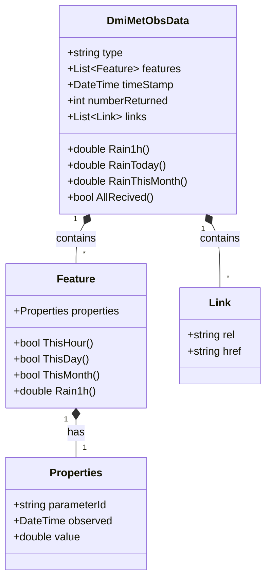

```mermaid
classDiagram
    class DmiMetObsData {
        +string type
        +List~Feature~ features
        +DateTime timeStamp
        +int numberReturned
        +List~Link~ links
        +double Rain1h()
        +double RainToday()
        +double RainThisMonth()
        +bool AllRecived()
    }

    class Feature {
        +Properties properties
        +bool ThisHour()
        +bool ThisDay()
        +bool ThisMonth()
        +double Rain1h()
    }

    class Properties {
        +string parameterId
        +DateTime observed
        +double value
    }

    class Link {
        +string rel
        +string href
    }

    DmiMetObsData "1" *-- "*" Feature : contains
    DmiMetObsData "1" *-- "*" Link : contains
    Feature "1" *-- "1" Properties : has
```